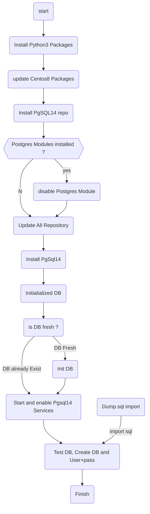

# Ansible-Cent8_PgSql14
Ansible Automation script to Install Postgresql14 on Centos 8

# Requierement
- Fresh Install Centos 8
- Centos Repository
- Insternet Connection

# Diagram

```mermaid
flowchart TD;
A(start) --> B(Install Python3 Packages)
B-->C(update Centos8 Packages)
C-->D(Install PgSQL14 repo)
D-->E{{Postgres Modules installed ?}}
E--yes-->F(disable Postgres Module)
E--No-->G(Update All Repository)
F-->G
G-->H(Install PgSql14)
H-->I(Initialialized DB)
I-->J(is DB fresh ?)
J--DB already Exist-->K(Start and enable Pgsql14 Services)
J--DB Fresh-->L(Init DB)
L-->K
K-->M(Test DB, Create DB and User+pass)
N(Dump.sql import) --import sql-->M
M-->O(Finish)


```
