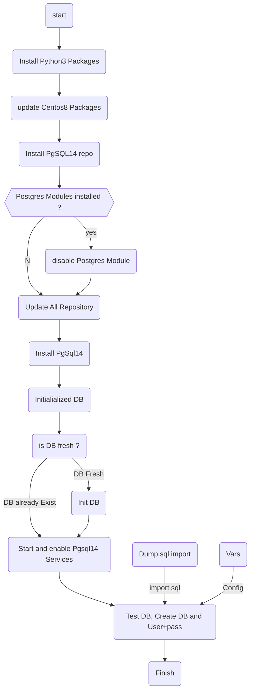

# Ansible-Cent8_PgSql14
Ansible Automation script to Install Postgresql14 on Centos 8

# Requierement
- Fresh Install Centos 8
- Centos Repository
- Insternet Connection

# Variable
Variable files, vars.yml

      db_user: admin
      db_password: Passw0rd
      db_name: testdb

## Dump SQL test file
files/dump.sql

    CREATE TABLE IF NOT EXISTS test (           
    message varchar(255) NOT NULL         
    );          
    INSERT INTO test(message) VALUES('Ansible is fun');
    ALTER TABLE test OWNER TO "admin";

# Diagram

## How to install

- please edit 'hosts' file that compatible with tour server infrastructure
- running the playbook with this command "ansible-palybook -i host pgsql14.yml"

## Thanks
contributor : t3mp30r3k@2022 (kangoprek.com) - rusdianto

